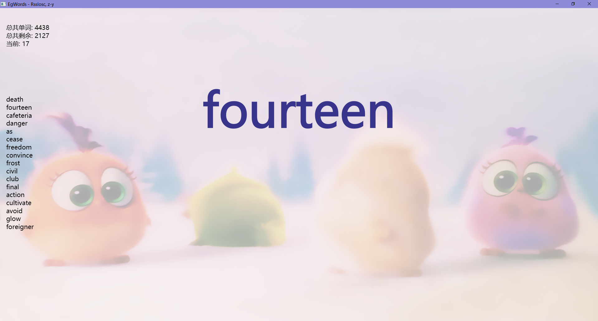

**EgWords**

1.0.0

本软件使用javafx-fxml编写项目代码以开源至GitHub

https://github.com/Rsslosc/EgWords

**获取方式**

一、对于具有java环境的使用者：

链接：https://pan.baidu.com/s/1-wYNHJ7YYeZX8L-7ULeI5g 

提取码：1234 

二、对于没有java环境的使用者：

链接：https://pan.baidu.com/s/1vkD5PcT1DFdw5ahP2V6czA 

提取码：1234 

**打开**

一、对于具有java环境的使用者：

下载EgWords.zip后

双击EgWords.jar即可打开

或者java -jar EgWords.jar打开

三、对于没有java环境的使用者：

下载EgWords.zip后

双击EgWords.exe即可打开

 

 

**开始使用**

对于出现的单词，可以根据掌握情况按下键盘对于的按键

 

将会显示出对应的解释意思

 

**注意：**

1.当按下“完全掌握”时该单词不会再次出现

2.本软件不适用鼠标，只使用键盘操作（注意切换为英文输入法）

 

 

**背诵结束**

当背诵完毕后会出现一下提示，按任意键继续

 

 

 

 

 

**复习或继续**

背诵结束之后如果有未背会单词将会出现“回顾之前”按钮

按下对应按键即可

 

 

 

 

 

**自定义**

更改p1.jpg图片即可更改背景图片，默认设置透明度0.3，不固定长宽比

更改EnglishWords.txt即可更改单词列表

 

**注意：**

1.命名需要完全一致

 

 

**预计更新**

1. 功能

(1) 背景图片，背景动态图片，背景音乐，自动切换图片，互动式背景等

(2) 单词集合，单词搜索，单词例句，单词读音

(3) 自动滚动播放

2. 代码

(1) 代码优化

(2) 开发至vscode插件，移动端app

 

 

**注意**

1. 本软件属于测试版本，可能出现意想不到的问题，仅供参考

2. 本软件为开源软件，严禁商用

 